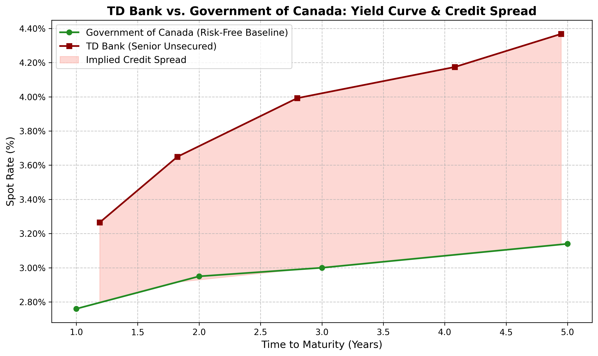

# Corporate Credit Risk Term Structure Analysis 📈
**The Toronto-Dominion Bank (TD): A Multi-Model Perspective (2026-2033)**

---

## 📄 Executive Summary
This study evaluates the creditworthiness of TD Bank across a 7-year horizon by juxtaposing three distinct quantitative frameworks. While the **CreditMetrics (Markov)** model provides a highly stable, ratings-based historical baseline (1-Year PD: 0.04%), the **Structural Merton/KMV** model reveals a theoretical "Leverage Trap," projecting an inflated long-term risk profile (7-Year PD ~3.25%) due to the bank's high leverage ratio and the square-root-of-time scaling of uncertainty. 

The **Market-Implied (Reduced-Form)** model serves as the real-time "truth," pricing a 1-year PD of **0.87\%**. This suggests that while structural models are mathematically sound, they often fail to account for the "Too Big to Fail" regulatory backstops and proactive capital management inherent in Systemically Important Financial Institutions (SIFIs).

---

## 🧠 Models Implemented

### 1. The CreditMetrics Model (Markov Chain)
* **Mechanism:** Utilizes a first-order Markov process applied to S\&P Global's historical 1-year transition matrices.
* **Engineering:** Includes algorithmic normalization of "Not Rated" (NR) categories and the implementation of a continuous "Default" absorbing state to calculate cumulative transition probabilities ($M^t$).
* **Output:** 1-Year PD of **0.04%** (Mapped to S\&P 'A' Bucket).
* **Data Evidence:** [See Ratings\_Data/](Evidence_Screenshots/Ratings_Data/)

### 2. The Merton/KMV Model (Structural)
* **Mechanism:** Treats corporate equity as a European call option on the firm's assets using the Black-Scholes-Merton framework.
* **Engineering:** Solves a non-linear system of equations (`scipy.optimize.fsolve`) to back-out latent Asset Value ($V = \$1.69T$) and Volatility ($\sigma_V = 0.0194$). Implements a dynamic debt barrier ($\gamma$) to neutralize unrealistic asset drift over long horizons.
* **Insight:** Exposes the **"Bank Leverage Trap."** In structural models, uncertainty scales by $\sqrt{T}$. For highly levered banks (90% debt), this math forces the asset value to eventually "wander" into the debt barrier over long horizons, even if the bank is currently healthy.
* **Data Evidence:** [See Balance\_Sheet/](Evidence_Screenshots/Balance_Sheet/)

### 3. Market-Implied Yield Spread (Reduced-Form)
* **Mechanism:** Extracts the real-time default probability priced in by live fixed-income traders.
* **Engineering:** Calculates the exact continuous Yield to Maturity (YTM) of a CAD-denominated TD corporate bond, accounting for exact day-count conventions and accrued interest. 
* **Output:** Calculated a YTM spread of **48 bps** against the Bank of Canada risk-free rate, implying a 1-Year PD of **0.87\%** (assuming 45\% recovery).
* **Technical Note:** Bootstrapping the curve to extract pure Zero-Coupon Spot Rates yields a slightly wider spread of **51 bps**. This 3 bps discrepancy accurately reflects the mathematical difference between YTM discounting and stripped spot pricing in an upward-sloping yield curve environment.
* **Data Evidence:** [See Market\_Data/](Evidence_Screenshots/Market_Data/)

---

## 📊 Results & Visualization
The term structure below illustrates the divergence between historical rating stability and theoretical structural risk over a 7-year horizon.

## 🛠️ Tech Stack
* **Python 3.x:** `NumPy`, `SciPy`, `Matplotlib`, `yfinance`.
* **Methodology:** Numerical optimization, Matrix exponentiation, and Continuous discounting.

---

## 👨‍💻 Author
**Henry Vianna**
* BSc Honours (Mathematical Applications in Economics and Finance) | University of Toronto
