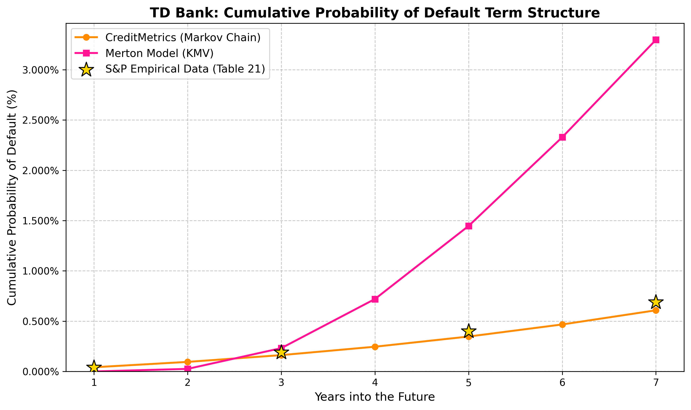

# Corporate Credit Risk Term Structure Analysis 📈

**The Toronto-Dominion Bank (TD): A Multi-Model Perspective (2026-2033)**

---

## 📄 Executive Summary (APM466 Assignment 2)

This study evaluates the creditworthiness of TD Bank across a 7-year horizon by juxtaposing three distinct quantitative frameworks. While the **CreditMetrics (Markov)** model provides a stable, ratings-based historical baseline (PD < 0.7%), the **Structural Merton/KMV** model reveals a theoretical "Leverage Trap," projecting an inflated risk profile (PD ~3.25%) due to the bank's high leverage ratio and the square-root-of-time scaling of uncertainty. 

The **Market-Implied (Reduced-Form)** model serves as the real-time "truth," pricing a 1-year PD of **1.48%**. This suggests that while structural models are mathematically sound, they often fail to account for the "Too Big to Fail" regulatory backstops and proactive capital management inherent in Systemically Important Financial Institutions (SIFIs).

---

## 🧠 Models Implemented

### 1. The CreditMetrics Model (Markov Chain)
* **Mechanism:** Utilizes a first-order Markov process applied to S&P Global's historical 1-year transition matrices.
* **Engineering:** Includes algorithmic normalization of "Not Rated" (NR) categories and the implementation of a continuous "Default" absorbing state to calculate cumulative transition probabilities ($M^t$).
* **Insight:** Highlights the "Ratings Momentum" phenomenon, where empirical multi-year default rates often exceed pure Markovian projections.

### 2. The Merton/KMV Model (Structural / First Passage Time)
* **Mechanism:** Treats corporate equity as a barrier option on the firm's assets using Black-Cox First Passage Time mathematics.
* **Engineering:** Implements a dynamic debt barrier ($\gamma$) to neutralize unrealistic asset drift over long horizons. Utilizes standard Brownian motion assumptions (Normal Distribution) to isolate the impact of leverage on term structure.
* **Insight:** Exposes the **"Bank Leverage Trap."** In structural models, uncertainty scales by $\sqrt{T}$. For highly levered banks (~90% debt), this math forces the asset value to eventually "wander" into the debt barrier over long horizons, even if the bank is currently healthy.

### 3. Market-Implied Yield Spread (Reduced-Form)
* **Mechanism:** Extracts the real-time default probability priced in by live fixed-income traders.
* **Engineering:** Uses numerical root-finding (`scipy.optimize.fsolve`) to calculate the exact continuous Yield to Maturity (YTM) of a CAD-denominated TD corporate bond (Maturing 06/2027), accounting for exact day-count conventions and accrued interest ($AI$).

## 📊 Term Structure Visualization
*(Link your saved image here)*

## 🛠️ Tech Stack & Methodology
* **Python 3.x:** `NumPy` (Matrix math), `SciPy` (Optimization/Stats), `Matplotlib` (Visualization).
* **Data Sources:** Bank of Canada (1Y T-Bill), Business Insider (TD Senior Unsecured CAD Bond), S&P Global (Transition Matrices).

---

## 👨‍💻 Author
**Henry Vianna**
* BSc Honours (Mathematical Applications in Economics and Finance) | University of Toronto
* *Quantitative Finance | Algorithmic Trading | Data Science*
