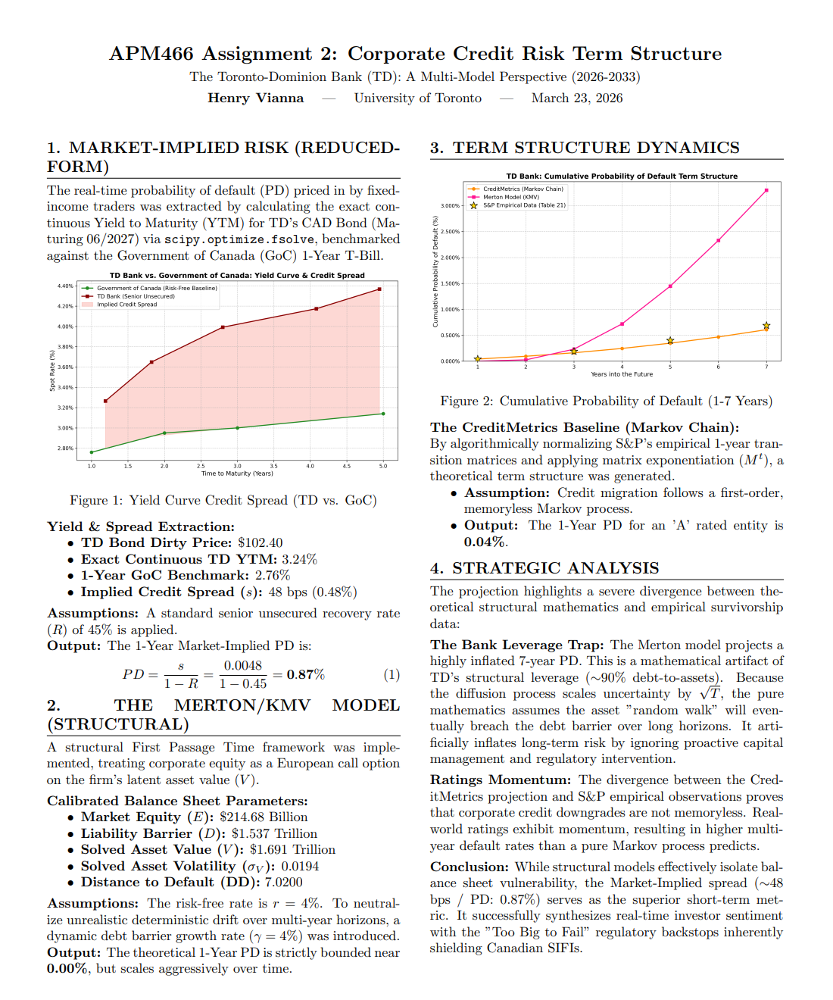

# Corporate Credit Risk Term Structure Analysis 📈

---

## 📄 Official 1-Page Summary
*(Click the image below to view the full PDF document)*

<div align="center">
  <a href="APM466_Assignment_2_1_page_summary.pdf">
    
  </a>
</div>

---

## 🔬 Technical Deep Dive & Methodology Notes

### The 3 Basis Point Discrepancy (YTM vs. Spot Spread)
In evaluating the Market-Implied PD, two distinct continuous discounting methods were applied to the TD CAD Bond (Maturing 06/2027), yielding a minor but mathematically significant 3 bps spread discrepancy:
1. **Yield to Maturity (YTM) Spread (48 bps):** Derived using a standard constant discount rate across all cash flows. Because the TD bond pays a 4.21% coupon, earlier cash flows are discounted at lower rates in a normal upward-sloping curve, pulling the average yield down slightly.
2. **Bootstrapped Spot Spread (51 bps):** Derived by mathematically stripping out coupon payments to find the pure, theoretical "Zero-Coupon" rate. The pure 1-year spot rate is naturally higher than the YTM of a coupon-bearing bond. 
*Note: The 48 bps YTM spread was ultimately utilized for the final PD calculation to reflect standard fixed-income trading quoting conventions.*

---

## 📂 File Structure & Tech Stack

**Language & Libraries:** Python 3.x, `NumPy`, `SciPy` (Optimization & Stats), `Matplotlib`, `yfinance`.

```text
Assignment2_APM466/
│
├── 📂 Models_and_Scripts/          
│   ├── graphs.py                  # Final Term Structure Visualization
│   ├── Merton_KMV_model.py        # Structural Model Solver
│   ├── CreditMetrics_model.py     # Ratings Transition Logic
│   └── td_spread_graph.py         # YTM & Spot Bootstrapping against GoC
│
├── 📂 Evidence_Screenshots/        
│   ├── 📂 Market_Data/            # BoC Treasury Yields & TD CAD Bond Prices
│   ├── 📂 Balance_Sheet/          # TD 2025 Form 40-F
│   └── 📂 Ratings_Data/           # S&P Transition Matrices
│
├── 📂 Results/                     
│   ├── Assignment2_Summary_Image.png  
│   ├── TD_Bank_PD_Term_Structure.png
│   └── TD_vs_GoC_Credit_Spread.png
│
├── APM466_Assignment_2_1_page_summary.pdf 
└── README.md
